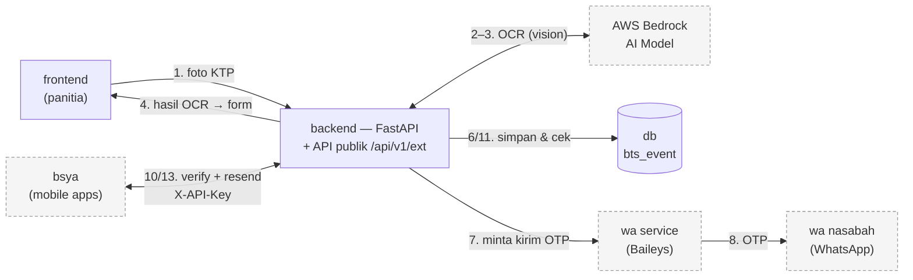
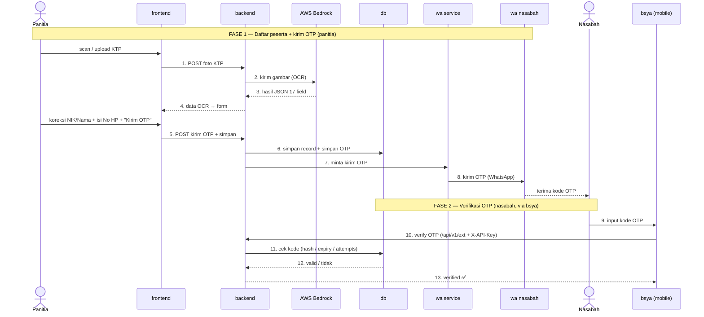

# Arsitektur — OCR KTP + OTP WhatsApp (Event BTS)

Ringkasan komponen, alur, dan urutan proses. Diagram pakai **Mermaid** (ter-render
otomatis di GitHub).

> Dokumen terkait: [API publik untuk mobile](public-api.md) ·
> [Alternatif provider WhatsApp](whatsapp-alternatives.md)

---

## Komponen

| Komponen | Teknologi | Peran |
|---|---|---|
| **frontend** | Next.js 16 | App panitia: kamera/scan KTP + form (NIK, Nama, No HP), kirim OTP |
| **backend** | FastAPI | Otak sistem: OCR, logika OTP, simpan data, **+ API publik `/api/v1/ext`** |
| **AWS Bedrock** | Vision LLM | OCR: foto KTP → JSON 17 field |
| **wa service** | Node + Baileys | Pengirim pesan WhatsApp (companion device) |
| **wa nasabah** | WhatsApp | WhatsApp milik nasabah yang menerima OTP |
| **db** | PostgreSQL | `ktp_records` (data peserta) + `otp_codes` (kode OTP) |
| **bsya (mobile apps)** | Native mobile | Konsumer eksternal: verifikasi & kirim ulang OTP via API publik |

---

## Diagram komponen

> **Penting:** `bsya` (mobile) **tidak mengakses `db` langsung**. Mobile memanggil
> **API publik di backend** (`/api/v1/ext/*` + `X-API-Key`), lalu **backend** yang
> query `db`. Jadi alurnya `bsya → backend (API publik) → db` — demi keamanan
> (API key, validasi, rate-limit).

---

## Urutan proses (sequence)

### Urutan ringkas
**Fase 1 (panitia):** `frontend → backend → Bedrock → (form) → backend → db (simpan) → wa service → WhatsApp nasabah`

**Fase 2 (nasabah/bsya):** `bsya → backend (API publik) → db (cek) → verified ✅`

---

## Keamanan antar-jalur

| Jalur | Proteksi |
|---|---|
| frontend → backend | CORS allowlist (origin frontend) |
| backend → wa service | `x-api-key` internal (`WA_GATEWAY_API_KEY`) + private network |
| **bsya → backend** (`/ext`) | **`X-API-Key`** (`EXT_API_KEYS`) + HTTPS |
| OTP | kode di-hash, expiry 5 mnt, cooldown 60 dtk, maks 5 percobaan |

---

## Deployment (Railway)

| Service | Root dir | Catatan |
|---|---|---|
| frontend | `frontend` | `NEXT_PUBLIC_API_BASE_URL` → backend |
| backend | `backend` | env: AWS, `DATABASE_URL`, CORS, `WA_*`, `EXT_API_KEYS` |
| wa service | `wa-gateway` | **Volume `/app/auth`** (sesi WA), scan QR di `/qr` |
| Postgres | — | `${{Postgres.DATABASE_URL}}` |

backend ↔ wa service lewat **private networking** (`*.railway.internal:3000`);
publik (frontend & bsya) lewat **HTTPS**.
