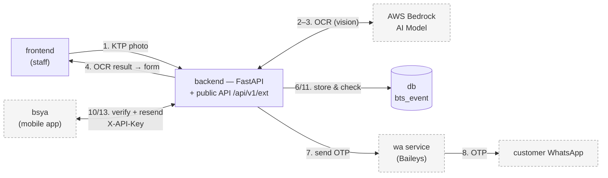
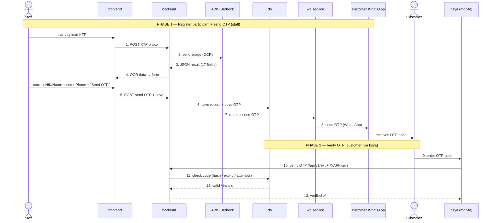

# Architecture — KTP OCR + WhatsApp OTP (Event BTS)

Overview of components, flow, and processing order. Diagrams use **Mermaid**
(rendered automatically on GitHub).

> Related docs: [Public API for mobile](public-api.md) ·
> [WhatsApp provider alternatives](whatsapp-alternatives.md)

---

## Components

| Component | Tech | Role |
|---|---|---|
| **frontend** | Next.js 16 | Staff app: camera/scan KTP + form (NIK, Name, Phone), send OTP |
| **backend** | FastAPI | System core: OCR, OTP logic, persistence, **+ public API `/api/v1/ext`** |
| **AWS Bedrock** | Vision LLM | OCR: KTP photo → structured JSON (17 fields) |
| **wa service** | Node + Baileys | WhatsApp message sender. **Multi-number pool** (`WA_SESSIONS`) with round-robin + failover when a number is down/restricted |
| **customer WhatsApp** | WhatsApp | The customer's WhatsApp that receives the OTP |
| **db** | PostgreSQL | `ktp_records` (participant data) + `otp_codes` (OTP codes) |
| **bsya (mobile app)** | Native mobile | External consumer: verify & resend OTP via the public API |

---

## Component diagram

> **Important:** `bsya` (mobile) **does not access `db` directly**. The mobile app
> calls the **public API on the backend** (`/api/v1/ext/*` + `X-API-Key`), and the
> **backend** queries `db`. So the path is `bsya → backend (public API) → db` — for
> security (API key, validation, rate limiting).

---

## Process order (sequence)

### Short version
**Phase 1 (staff):** `frontend → backend → Bedrock → (form) → backend → db (save) → wa service → customer WhatsApp`

**Phase 2 (customer/bsya):** `bsya → backend (public API) → db (check) → verified ✅`

---

## Security per path

| Path | Protection |
|---|---|
| frontend → backend | CORS allowlist (frontend origin) |
| backend → wa service | internal `x-api-key` (`WA_GATEWAY_API_KEY`) + private network |
| **bsya → backend** (`/ext`) | **`X-API-Key`** (`EXT_API_KEYS`) + HTTPS |
| OTP | code hashed, 5-min expiry, 60s resend cooldown, max 5 attempts |

---

## Deployment (Railway)

| Service | Root dir | Notes |
|---|---|---|
| frontend | `frontend` | `NEXT_PUBLIC_API_BASE_URL` → backend |
| backend | `backend` | env: AWS, `DATABASE_URL`, CORS, `WA_*`, `EXT_API_KEYS` |
| wa service | `wa-gateway` | **Volume `/app/auth`** (WA session), scan QR at `/qr` |
| Postgres | — | `${{Postgres.DATABASE_URL}}` |

backend ↔ wa service over **private networking** (`*.railway.internal:3000`);
public traffic (frontend & bsya) over **HTTPS**.
